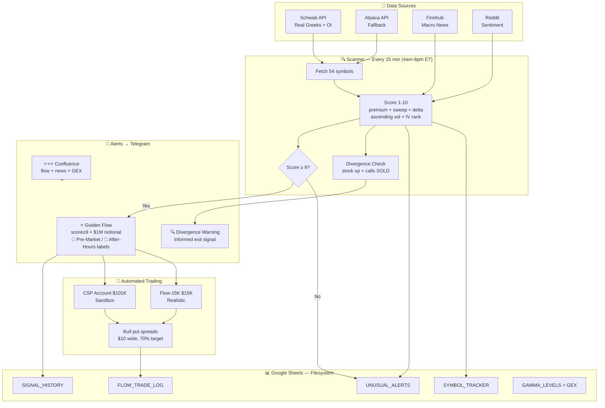

# Options Flow Scanner 📊

> Institutional options flow intelligence + automated paper trading.
> Tracks smart money across **54 symbols** every 15 minutes. Executes bull put spreads on confirmed signals.

**Goal:** Flow + news + GEX + price trend → confluence → automated spread selling → measured edge

---

## What This System Actually Does

**Every 15 minutes during extended hours (8:00-00:00 UTC / 4am-8pm ET):**
```
1. Fetch options chain for 54 symbols
   → Schwab API (real Greeks/OI/volume) or Alpaca fallback
2. Filter: premium > $25K or sweep ($1M notional)
3. Score each contract 1-10 (see scoring table below)
4. Detect divergence: stock up 5%+ but calls being SOLD → exit warning
5. Detect Golden Flow: sweep + score≥9 + $1M+ → Telegram alert
   Session labels: 🌅 Pre-Market | (none) Regular | 🌆 After-Hours
6. Detect ⭐⭐⭐ confluence: flow + news + GEX all agree → Telegram alert
7. Write to Google Sheets (our filesystem)
```
```
1. Fetch options chain for 54 symbols
   → Schwab API (real Greeks/OI/volume) or Alpaca fallback
2. Filter: premium > $25K or sweep > 500 contracts
3. Score each contract 1-10 (see scoring table below)
4. Detect divergence: stock up 5%+ but calls being SOLD → exit warning
5. Detect Golden Flow: sweep + score≥9 + $1M+ → Telegram alert
6. Detect ⭐⭐⭐ confluence: flow + news + GEX all agree → Telegram alert
7. Write to Google Sheets (our filesystem)
```

**Every day at market close (22:30 UTC):**
```
8.  OI Tracker: real OI per strike (Schwab), day-over-day change
    → "Long Buildup / Short Buildup" signals
9.  Gamma Levels: Max Pain, Call Wall, Put Wall, GEX (real gamma from Schwab)
10. Signal Outcomes: did signals predict price moves? (tracks accuracy)
11. flow_trader: execute/exit bull put spreads
    → CSP account ($101K sandbox)
    → Flow-15K account ($15K realistic)
```

**Every morning (12:00 UTC):**
```
12. Morning Brief: Finnhub macro + FinBERT sentiment + Reddit + GEX
    → Gemini AI synthesizes → Telegram
```

---

## System Architecture


---

## Scoring System (1-10)

| Points | Condition | Why |
|--------|-----------|-----|
| +5 | Premium ≥ $20M | Massive institutional size |
| +4 | Premium ≥ $10M | Large institutional |
| +3 | Premium ≥ $5M | Significant |
| +2 | Premium ≥ $1M | Meaningful |
| +1 | Premium ≥ $100K | Minimum threshold |
| **+3** | **Ascending volume (strong)** | **Unusual Whales #1 signal: "repeat action with ascending size"** |
| +1 | Ascending volume (weak) | Growing interest |
| +3 | Volume 10× 30-day baseline | Extremely unusual |
| +2 | Volume 5× baseline | Very unusual |
| +1 | Volume 3× baseline | Unusual |
| +2 | **Sweep ($1M+ notional)** | **Dynamic: scales by stock price** |
| +2 | ATM delta (0.35-0.65) | Directional bet, not hedge |
| +2 | **IV rank ≥70 on calls** | **Dynamic: relative to each stock's own history** |
| +2 | 0-7 DTE | Event-driven bet |
| +1 | 8-30 DTE | Near-term positioning |
| +2 | IV rank High (≥70) | Expensive = sell premium |
| +1 | IV rank Low (≤30) | Cheap = buy options |
| +1 | Theta decay high | Good spread selling timing |
| **CAP** | **Deep ITM (delta >0.85) → max score 4** | **Hedge, not signal (Unusual Whales confirmed)** |

**All thresholds are dynamic (not hardcoded):**
- Sweep = $1M notional (SOFI needs 625 contracts, SPY needs 14 — same dollar signal)
- IV spike = IV rank ≥70 (relative to each stock's own 30-day history, not raw 80%)
- Deep ITM cap = delta >0.85 (removes rolling hedges from scoring)

**Score levels:**
```
Score 9-10 → Auto-trade (100% win rate from data) + Telegram alert
Score 7-8  → Telegram alert only (manual decision)
Score ≤6   → Silent (stored in sheets, no alert)
```

**Golden Flow** = score ≥9 + sweep ($1M notional) + premium ≥$1M → Telegram alert + trade execution

---

## Signal Quality (from actual data)

| Score | Win rate | Action |
|-------|---------|--------|
| 10 | **100%** (6/6) | Execute immediately |
| 9 | **100%** (13/13) | Execute immediately |
| 8 | 39% (45/115) | Alert only, don't trade |
| 7 | 43% (233/538) | Alert only |

**Key insight:** Score 9-10 = 100% win rate. Score 8 is dragged down by deep ITM rolling positions (now capped at 4).

---

## Divergence Warning (POET Pattern)

When a stock is up 5%+ but calls are being SOLD:
```
Stock rising + calls being sold = informed money exiting
= Someone knows bad news is coming (like POET Apr 24)

Alert: "⚠️ POET up +27% but calls SOLD ($151K sell vs $12K buy)"
Action: Consider reducing position
```

**Case study:** POET Apr 24 — our scanner caught insiders selling calls while stock was up 27%. Three days later stock crashed -47% when Marvell cancellation was disclosed publicly.

---

## Trading Accounts

| Account | Balance | Purpose | Spread | Max Risk |
|---------|---------|---------|--------|---------|
| CSP/FlowTrader | $101K | Sandbox testing | $10 wide | $2,000 |
| **Flow-15K** | **$15K** | **Realistic live-like** | **$10 wide** | **$750 (5%)** |
| Iron-Condor | $101K | Iron condor strategy | — | — |
| Covered-Call | $101K | Covered call strategy | — | — |
| Live (Alpaca) | $17K | Real money | Manual | — |

---

## Live Trading Plan (€2,000/month)

```
€1,200 → Long-term stocks (buy & hold)
€800   → Options trading capital (Alpaca live)
```

**Decision tree:**
```
Scanner signal BULLISH  → Bull Put Spread
Scanner signal BEARISH  → Bear Call Spread
Scanner signal SIDEWAYS → Iron Condor
```

**SPY only for live trading** (most liquid, no single-stock risk)

**Expansion path:**
```
Month 1-6:  SPY only
Month 7-12: Add QQQ
Year 2+:    Maybe 1 individual stock
```

---

## Watchlist (54 symbols)

| Group | Symbols |
|-------|---------|
| Index ETFs | SPY, QQQ, IWM |
| Sector ETFs | XLK, XLF, XLE, XLV, GLD, TLT, ITA, USO, UUP, XBI, ARKK |
| Defence | LMT, RTX, NOC, GD |
| Cyber | CRWD, PANW, ZS |
| Mega caps | AAPL, GOOGL, MSFT, NVDA, AMZN, META, TSLA, **AVGO, NFLX, UBER, CRM** |
| High vol | AMD, COIN, MSTR, HOOD, SMCI, ARM, SNOW, ASTS, NBIS, RMBS |
| Portfolio | PLTR, CRWV, IONQ, OKLO, ACHR, DUOL, SOFI, PYPL, PATH, JOBY, UUUU, POET |

**Flow-15K tradeable:** SPY, QQQ, AAPL, NVDA, MSFT, AMZN, META, TSLA, GOOGL, AVGO, NFLX, UBER, CRM, AMD, PLTR, SOFI, COIN

---

## Honest Assessment vs Professional Tools

| Feature | Our system | Unusual Whales ($75/mo) |
|---------|-----------|------------------------|
| Scan frequency | Every 15 min | Real-time |
| Real Greeks | ✅ Schwab OPRA | ✅ |
| Ascending volume | ✅ | ✅ |
| Deep ITM filter | ✅ | ✅ |
| Dark pool | ❌ | ✅ |
| Automated trading | ✅ | ❌ |
| Signal outcomes tracking | ✅ | ❌ |
| Cost | Free | $75/mo |

---

## Schwab Integration

Real-time OPRA data via Schwab API (free with brokerage account):
- Real delta, gamma, theta, vega
- Real OI (was always 0 with Alpaca)
- Real-time prices (replaces delayed yfinance)
- Token stored in Google Sheets (persists across GitHub Actions)

**Re-authenticate monthly:**
```bash
python schwab_cli.py auth
python schwab_token_store.py save
```

---

## Case Studies

| Date | Stock | Signal | Outcome |
|------|-------|--------|---------|
| Apr 24, 2026 | POET | Calls SOLD into +27% rally | Stock -47% three days later |

See `case_studies/` folder for detailed analysis.

---

## Journal

Daily trading journals in `journal/YYYY-MM-DD/SYMBOL_journal.md`
- Options chain analysis (Schwab real-time)
- Greeks interpretation
- Action taken
- Post-earnings review

---

## Disclaimer
Educational and research purposes only. Options trading involves significant risk.
Past flow patterns do not guarantee future price movements. Not financial advice.
