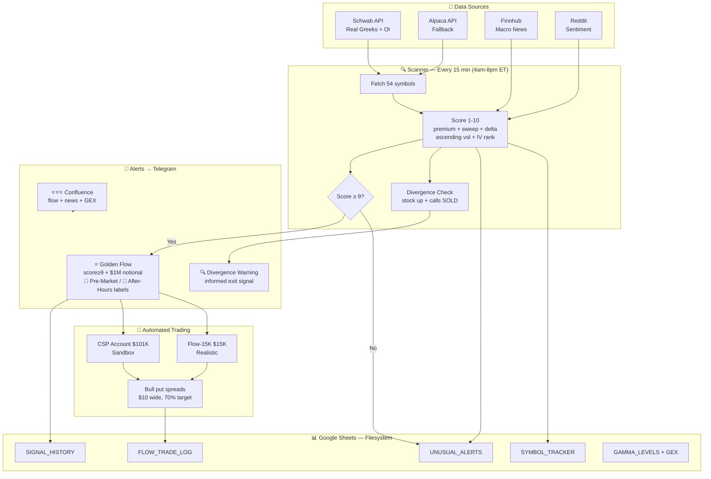

# Options Flow Scanner 📊

> Institutional options flow intelligence + automated paper trading.
> Tracks smart money across **54 symbols** every 15 minutes. Executes bull put spreads on confirmed signals.

**Goal:** Flow + news + GEX + price trend → confluence → automated spread selling → measured edge

---

## What This System Actually Does

**Every 15 minutes during extended hours (8:00-00:00 UTC / 4am-8pm ET):**
```
1. Fetch options chain for 54 symbols
   → Schwab API (real Greeks/OI/volume) or Alpaca fallback
2. Filter: premium > $25K or sweep ($1M notional)
3. Score each contract 1-10 (see scoring table below)
4. Detect divergence: stock up 5%+ but calls being SOLD → exit warning
5. Detect Golden Flow: sweep + score≥9 + $1M+ → Telegram alert
   Session labels: 🌅 Pre-Market | (none) Regular | 🌆 After-Hours
6. Detect ⭐⭐⭐ confluence: flow + news + GEX all agree → Telegram alert
7. Write to Google Sheets (our filesystem)
```
```
1. Fetch options chain for 54 symbols
   → Schwab API (real Greeks/OI/volume) or Alpaca fallback
2. Filter: premium > $25K or sweep > 500 contracts
3. Score each contract 1-10 (see scoring table below)
4. Detect divergence: stock up 5%+ but calls being SOLD → exit warning
5. Detect Golden Flow: sweep + score≥9 + $1M+ → Telegram alert
6. Detect ⭐⭐⭐ confluence: flow + news + GEX all agree → Telegram alert
7. Write to Google Sheets (our filesystem)
```

**Every day at market close (22:30 UTC):**
```
8.  OI Tracker: real OI per strike (Schwab), day-over-day change
    → "Long Buildup / Short Buildup" signals
9.  Gamma Levels: Max Pain, Call Wall, Put Wall, GEX (real gamma from Schwab)
10. Signal Outcomes: did signals predict price moves? (tracks accuracy)
11. flow_trader: execute/exit bull put spreads
    → CSP account ($101K sandbox)
    → Flow-15K account ($15K realistic)
```

**Every morning (12:00 UTC):**
```
12. Morning Brief: Finnhub macro + FinBERT sentiment + Reddit + GEX
    → Gemini AI synthesizes → Telegram
```

---

## System Architecture


---

## Scoring System (1-10)

| Points | Condition | Why |
|--------|-----------|-----|
| +5 | Premium ≥ $20M | Massive institutional size |
| +4 | Premium ≥ $10M | Large institutional |
| +3 | Premium ≥ $5M | Significant |
| +2 | Premium ≥ $1M | Meaningful |
| +1 | Premium ≥ $100K | Minimum threshold |
| **+3** | **Ascending volume (strong)** | **Unusual Whales #1 signal: "repeat action with ascending size"** |
| +1 | Ascending volume (weak) | Growing interest |
| +3 | Volume 10× 30-day baseline | Extremely unusual |
| +2 | Volume 5× baseline | Very unusual |
| +1 | Volume 3× baseline | Unusual |
| +2 | **Sweep ($1M+ notional)** | **Dynamic: scales by stock price** |
| +2 | ATM delta (0.35-0.65) | Directional bet, not hedge |
| +2 | **IV rank ≥70 on calls** | **Dynamic: relative to each stock's own history** |
| +2 | 0-7 DTE | Event-driven bet |
| +1 | 8-30 DTE | Near-term positioning |
| +2 | IV rank High (≥70) | Expensive = sell premium |
| +1 | IV rank Low (≤30) | Cheap = buy options |
| +1 | Theta decay high | Good spread selling timing |
| **CAP** | **Deep ITM (delta >0.85) → max score 4** | **Hedge, not signal (Unusual Whales confirmed)** |

**All thresholds are dynamic (not hardcoded):**
- Sweep = $1M notional (SOFI needs 625 contracts, SPY needs 14 — same dollar signal)
- IV spike = IV rank ≥70 (relative to each stock's own 30-day history, not raw 80%)
- Deep ITM cap = delta >0.85 (removes rolling hedges from scoring)

**Score levels:**
```
Score 9-10 → Auto-trade (100% win rate from data) + Telegram alert
Score 7-8  → Telegram alert only (manual decision)
Score ≤6   → Silent (stored in sheets, no alert)
```

**Golden Flow** = score ≥9 + sweep ($1M notional) + premium ≥$1M → Telegram alert + trade execution

---

## Signal Quality (from actual data)

| Score | Win rate | Action |
|-------|---------|--------|
| 10 | **100%** (6/6) | Execute immediately |
| 9 | **100%** (13/13) | Execute immediately |
| 8 | 39% (45/115) | Alert only, don't trade |
| 7 | 43% (233/538) | Alert only |

**Key insight:** Score 9-10 = 100% win rate. Score 8 is dragged down by deep ITM rolling positions (now capped at 4).

---

## Divergence Warning (POET Pattern)

When a stock is up 5%+ but calls are being SOLD:
```
Stock rising + calls being sold = informed money exiting
= Someone knows bad news is coming (like POET Apr 24)

Alert: "⚠️ POET up +27% but calls SOLD ($151K sell vs $12K buy)"
Action: Consider reducing position
```

**Case study:** POET Apr 24 — our scanner caught insiders selling calls while stock was up 27%. Three days later stock crashed -47% when Marvell cancellation was disclosed publicly.

---

## Trading Accounts

| Account | Balance | Purpose | Spread | Max Risk |
|---------|---------|---------|--------|---------|
| CSP/FlowTrader | $101K | Sandbox testing | $10 wide | $2,000 |
| **Flow-15K** | **$15K** | **Realistic live-like** | **$10 wide** | **$750 (5%)** |
| Iron-Condor | $101K | Iron condor strategy | — | — |
| Covered-Call | $101K | Covered call strategy | — | — |
| Live (Alpaca) | $17K | Real money | Manual | — |

---

## Live Trading Plan (€2,000/month)

```
€1,200 → Long-term stocks (buy & hold)
€800   → Options trading capital (Alpaca live)
```

**Decision tree:**
```
Scanner signal BULLISH  → Bull Put Spread
Scanner signal BEARISH  → Bear Call Spread
Scanner signal SIDEWAYS → Iron Condor
```

**SPY only for live trading** (most liquid, no single-stock risk)

**Expansion path:**
```
Month 1-6:  SPY only
Month 7-12: Add QQQ
Year 2+:    Maybe 1 individual stock
```

---

## Watchlist (54 symbols)

| Group | Symbols |
|-------|---------|
| Index ETFs | SPY, QQQ, IWM |
| Sector ETFs | XLK, XLF, XLE, XLV, GLD, TLT, ITA, USO, UUP, XBI, ARKK |
| Defence | LMT, RTX, NOC, GD |
| Cyber | CRWD, PANW, ZS |
| Mega caps | AAPL, GOOGL, MSFT, NVDA, AMZN, META, TSLA, **AVGO, NFLX, UBER, CRM** |
| High vol | AMD, COIN, MSTR, HOOD, SMCI, ARM, SNOW, ASTS, NBIS, RMBS |
| Portfolio | PLTR, CRWV, IONQ, OKLO, ACHR, DUOL, SOFI, PYPL, PATH, JOBY, UUUU, POET |

**Flow-15K tradeable:** SPY, QQQ, AAPL, NVDA, MSFT, AMZN, META, TSLA, GOOGL, AVGO, NFLX, UBER, CRM, AMD, PLTR, SOFI, COIN

---

## Honest Assessment vs Professional Tools

| Feature | Our system | Unusual Whales ($75/mo) |
|---------|-----------|------------------------|
| Scan frequency | Every 15 min | Real-time |
| Real Greeks | ✅ Schwab OPRA | ✅ |
| Ascending volume | ✅ | ✅ |
| Deep ITM filter | ✅ | ✅ |
| Dark pool | ❌ | ✅ |
| Automated trading | ✅ | ❌ |
| Signal outcomes tracking | ✅ | ❌ |
| Cost | Free | $75/mo |

---

## Schwab Integration

Real-time OPRA data via Schwab API (free with brokerage account):
- Real delta, gamma, theta, vega
- Real OI (was always 0 with Alpaca)
- Real-time prices (replaces delayed yfinance)
- Token stored in Google Sheets (persists across GitHub Actions)

**Re-authenticate monthly:**
```bash
python schwab_cli.py auth
python schwab_token_store.py save
```

---

## Case Studies

| Date | Stock | Signal | Outcome |
|------|-------|--------|---------|
| Apr 24, 2026 | POET | Calls SOLD into +27% rally | Stock -47% three days later |

See `case_studies/` folder for detailed analysis.

---

## Journal

Daily trading journals in `journal/YYYY-MM-DD/SYMBOL_journal.md`
- Options chain analysis (Schwab real-time)
- Greeks interpretation
- Action taken
- Post-earnings review

---

## Knowledge Base

- [Options Greeks Explained](knowledge/options_greeks_explained.md) — delta, gamma, theta, vega with real trade examples
- [Data Sources](knowledge/data_sources.md) — why Schwab/Alpaca/yfinance are each used
- [Flow Trader Execution Flow](knowledge/flow_trader_execution.md) — step-by-step what happens on each run
- [Scanner Logic](knowledge/scanner_logic.md) — how sweeps/unusual signals are detected, scoring system, 38K contracts/run
- [Flow Trader Code Explained](knowledge/flow_trader_code_explained.md) — line-by-line code walkthrough, data flow, design decisions

---

## Options Greeks Reference

| Greek | Measures | Simple explanation | Buyer wants | Seller wants |
|-------|---------|-------------------|------------|-------------|
| **Delta** | Stock price sensitivity | "If stock moves $1, option moves this much" | High (0.5+) | Low |
| **Gamma** | Delta acceleration | "How fast delta is changing" | High near expiry | Low (dangerous) |
| **Theta** | Time decay per day | "I lose this much every day just from time passing" | Low | **High (collect daily)** |
| **Vega** | IV sensitivity | "I change this much per 1% IV move" | High IV | **Low IV (after earnings)** |

**Greeks change by strike price (JOBY at $8.70):**
```
Strike  Type    Delta   Gamma   Theta   Vega    Who benefits
$8C     ITM     0.66    0.20    -0.08   0.01    Buyer (safer, expensive)
$9C     ATM     0.46    0.25    -0.05   0.01    Both (most sensitive)
$10C    OTM     0.14    0.10    -0.02   0.005   Buyer (cheap, lottery)
```

**The pattern:**
```
Delta:  increases going ITM (0.1 OTM → 0.5 ATM → 0.9 ITM)
Gamma:  highest at ATM (bell curve shape)
Theta:  highest at ATM (decays fastest)
Vega:   highest at ATM (most IV sensitive)
```

**Safer and cheaper — for whom?**
```
BUYER perspective:
  Safer  = ITM (delta 0.8+) — moves like stock, less likely to expire worthless
  Cheaper = OTM (delta 0.1) — costs less but needs big move to profit
  Best value = ATM (delta 0.5) — balanced risk/reward

SELLER perspective:
  Safer  = OTM (delta 0.1) — stock needs to move a lot to hurt you
  More premium = ATM (delta 0.5) — collects most theta
  Dangerous = ITM (delta 0.8+) — already losing money

Rule: What's safe for sellers is risky for buyers, and vice versa.
```

**How we use Greeks in our system:**

| Greek | How we use it | Where |
|-------|--------------|-------|
| **Delta** | Score +2 for ATM (0.35-0.65) = directional bet | `score_alert()` |
| **Delta** | Cap deep ITM (>0.85) at score 4 = hedge filter | `score_alert()` |
| **Delta** | Buy/sell detection: last price vs mid | `scan_symbol()` |
| **Gamma** | GEX = gamma × OI × spot² = call/put walls | `gamma_levels.py` |
| **Theta** | Score +1 for high theta puts = good spread timing | `score_alert()` |
| **IV/Vega** | IV rank: sell when IVR≥70, buy when IVR≤30 | `score_alert()` |
| **IV/Vega** | IV spike on calls = urgency signal | `score_alert()` |

**flow_trader uses Greeks to:**
```
1. Only trade ATM spreads (delta ~0.2 on short leg = 30-delta)
2. Exit at 70% profit (theta has done its job)
3. Close at 7 DTE (gamma risk too high near expiry)
4. Only enter when IV rank ≥50 (collect fat premium)
```

---
Educational and research purposes only. Options trading involves significant risk.
Past flow patterns do not guarantee future price movements. Not financial advice.

---

## Risk Management Rules

Based on Tastytrade research + GodzillaTrader sizing guidelines (Apr 2026):

```
Per trade:    Max 5% of account at risk
Total open:   Max 30% of account deployed at once
Earnings:     Skip if earnings falls within spread expiry window (live check)
Expiry:       21-45 DTE monthly (not weekly — gamma risk too high)
Profit exit:  50% of credit collected → 81% win rate (Tastytrade research)
Stop loss:    2× credit received
Gamma exit:   Close at 7 DTE regardless
```

**Why skip earnings:**
Earnings = binary event. IV is inflated (premium looks attractive) but actual
risk is much higher. A 20% gap can blow through the spread. Skip earnings,
trade non-earnings setups for consistent income.

**Why monthly not weekly:**
Weekly (7 DTE) has extreme gamma risk — small stock move = large option loss.
Monthly (21-45 DTE) gives time to recover and theta decays at optimal rate.

**Paper accounts:**
- Sandbox ($101K): tests all signals, no restrictions
- Realistic ($15K): applies all rules above, mirrors real-world constraints


---

## Data Sources

Each source is used for what it does best. Schwab is the primary source for all options data.

| Data | Source | Why |
|------|--------|-----|
| Options chain (Greeks, OI, IV, volume) | **Schwab** | Real-time, real Greeks — best quality |
| GEX / gamma levels | **Schwab** → Alpaca fallback | Real gamma × OI |
| OI day-over-day snapshots | **Schwab** → yfinance fallback | Real OI, not delayed |
| Stock quotes / market clock | **Alpaca** | Fast, free, reliable |
| Historical price bars | **Alpaca** | OHLCV data |
| News feed | **Alpaca News API** | Real-time news |
| Earnings calendar | **yfinance** | Only available source (Schwab doesn't provide it) |
| Trade execution | **Alpaca Paper API** | Schwab has no paper trading |

**What Schwab does NOT provide** (confirmed via schwab-py docs):
- No earnings calendar → yfinance used instead
- No news feed → Alpaca News API used instead
- No paper trading → Alpaca paper accounts used instead
- No historical options pricing data

